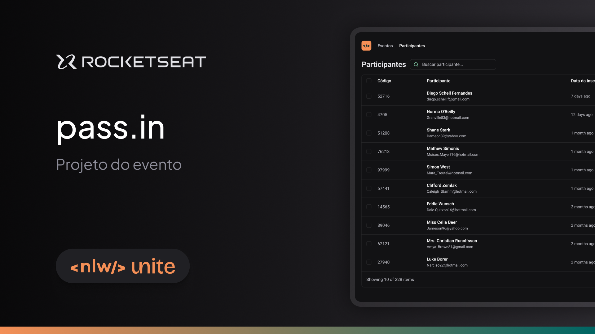

  
  
  <h1 align="left">Pass.in</h1>

  Aplicação Web desenvolvida na trilha React do evento NLW Unite da RocketSeat, com o objetivo de conhecer e explorar novas tecnologias, como React, Typescript e Tailwind CSS.

  
##  🚀 Tecnologias utilizadas

  
  
  
  

## 🎨 Layout da plataforma

  
Veja detalhes do design do projeto <a href="https://www.figma.com/design/HE0J9JzhUpJJ7W31dr5hVZ/NLW-Unite-%E2%80%A2-Pass.in?node-id=2007-1477&node-type=CANVAS&t=q1Lk5zcWsqGjJZUK-0">aqui</a>

## ✨ Contribuições

Se você encontrar algum erro ou tiver sugestões, sinta-se à vontade para abrir uma issue ou enviar um pull request. Suas contribuições são bem-vindas!

## 📫 Contato
Se você quiser entrar em contato comigo, você pode me encontrar através das seguintes plataformas:

